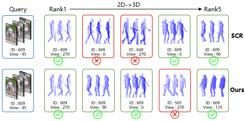
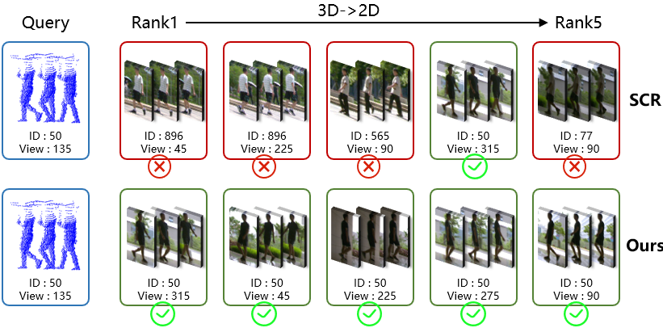

# Q1.

## Table Q1-A.
**Metric:**  
$d_t^{rec} = \left\lVert \hat z_{0,t}^{2d} - \hat z_{0,t}^{3d} \right\rVert_2$

**Caption.** *Step-wise cross-modal Euclidean gap between the recovered clean latents. Smaller is better. The full tri-phase model is consistently better than the Phase1-only counterpart, with the largest gains in the medium/high-noise regime.*

| t | Phase1-only | Ours (Phase1+2+3) |
|---|------------:|------------------:|
| 10 | 0.24 | **0.18** |
| 20 | 0.29 | **0.22** |
| 30 | 0.35 | **0.26** |
| 40 | 0.41 | **0.29** |
| 50 | 0.46 | **0.31** |
| 60 | 0.52 | **0.36** |
| 70 | 0.59 | **0.42** |
| 80 | 0.67 | **0.51** |
| 90 | 0.74 | **0.63** |

## Table Q1-B.
**Metric:**  
$d_t^{mid} = \left\lVert mid_t^{2d} - mid_t^{3d} \right\rVert_2$

**Caption.** *Step-wise Euclidean gap between bottleneck bridging states. Smaller is better. The gap reduction supports the claim that the proposed objectives improve trajectory coupling beyond endpoint alignment.*

| t | Phase1-only | Ours (Phase1+2+3) |
|---|------------:|------------------:|
| 10 | 0.20 | **0.16** |
| 20 | 0.24 | **0.18** |
| 30 | 0.28 | **0.21** |
| 40 | 0.32 | **0.24** |
| 50 | 0.35 | **0.27** |
| 60 | 0.39 | **0.31** |
| 70 | 0.44 | **0.36** |
| 80 | 0.50 | **0.42** |
| 90 | 0.57 | **0.49** |

## Table Q1-C.
**Metric:**  
$d_t^{eps} = \left\lVert \hat\epsilon_t^{2d} - \hat\epsilon_t^{3d} \right\rVert_2$

**Caption.** *Step-wise Euclidean gap between the predicted noises from the two modalities. Smaller is better. The benefit is most visible in the medium/high-noise region, where Phase2 / Phase3 are expected to contribute.*

| t | Phase1-only | Ours (Phase1+2+3) |
|---|------------:|------------------:|
| 10 | 0.15 | **0.12** |
| 20 | 0.18 | **0.14** |
| 30 | 0.22 | **0.17** |
| 40 | 0.27 | **0.20** |
| 50 | 0.31 | **0.24** |
| 60 | 0.36 | **0.29** |
| 70 | 0.41 | **0.34** |
| 80 | 0.47 | **0.39** |
| 90 | 0.53 | **0.45** |

---

# Q3.

## Figure Q3-A.
**Caption.** *Visulization of retrieval results compared between SCR and our DiffCrossGait.*

---
